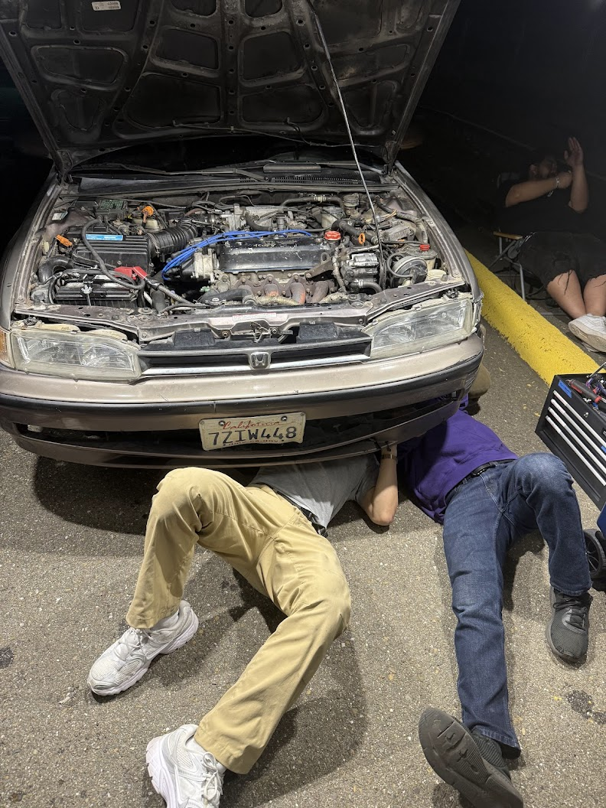
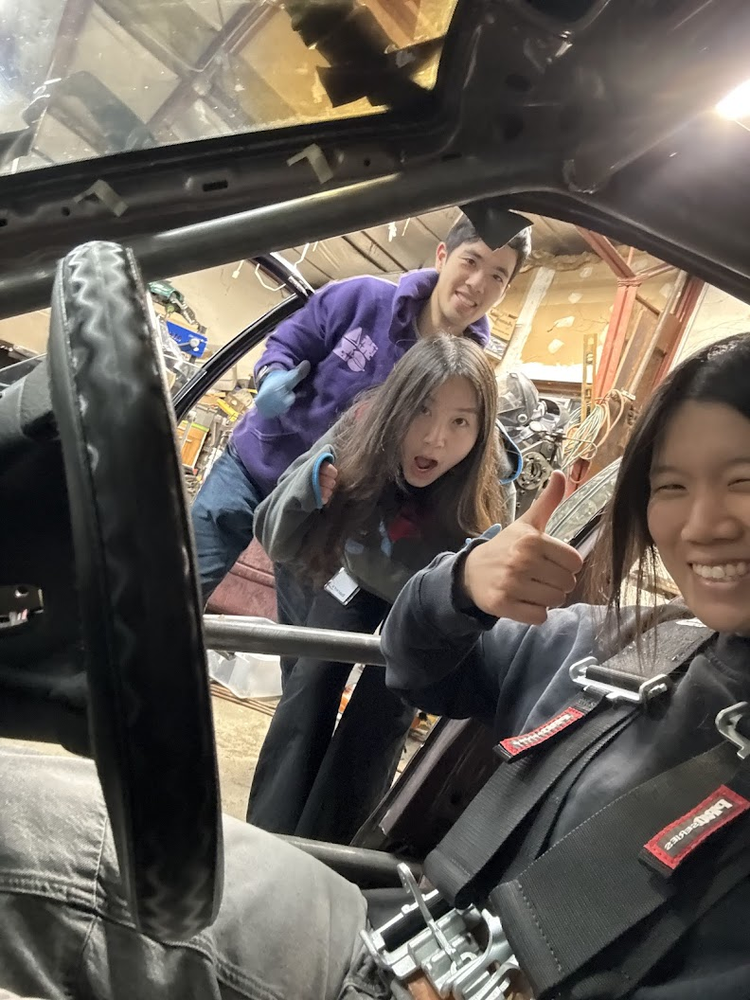
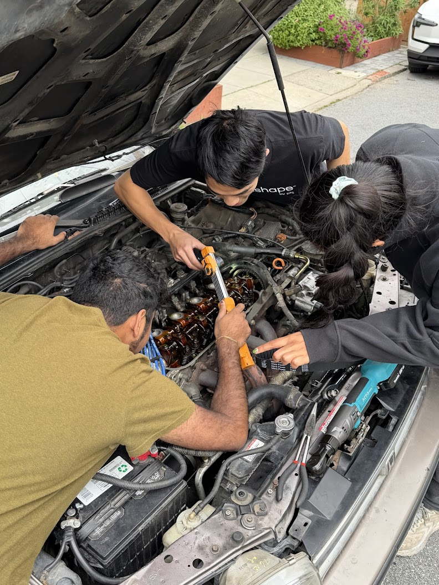
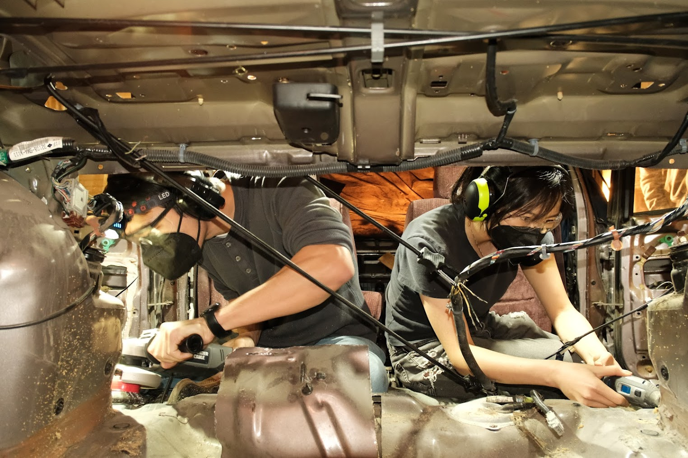

# About the Team

*Content coming soon — the story of how Magicar Motors got started.*

  

    
  

  

    
  

  
under the car at a Thunderhill trackday

  
wrenching at John's shop

  

    
  

  

    
  

  
three people deep in the bay

  
Max and Ariana on cleanup duty

