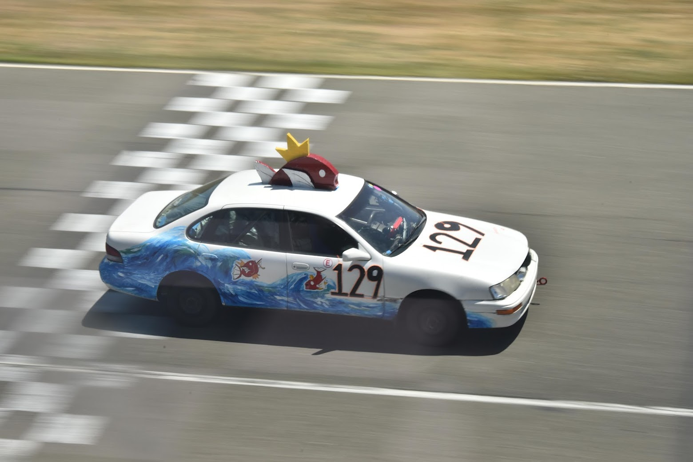
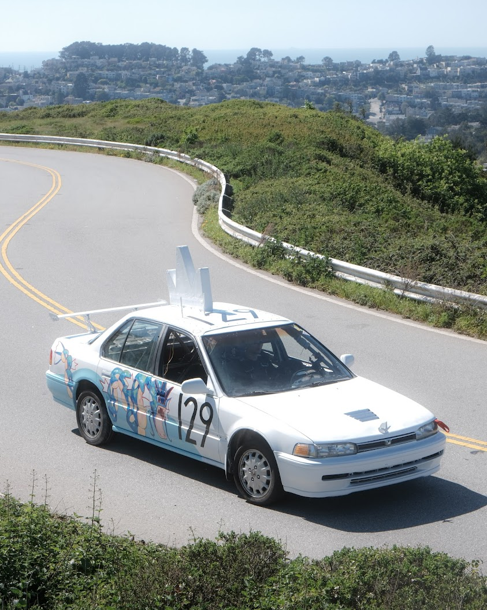
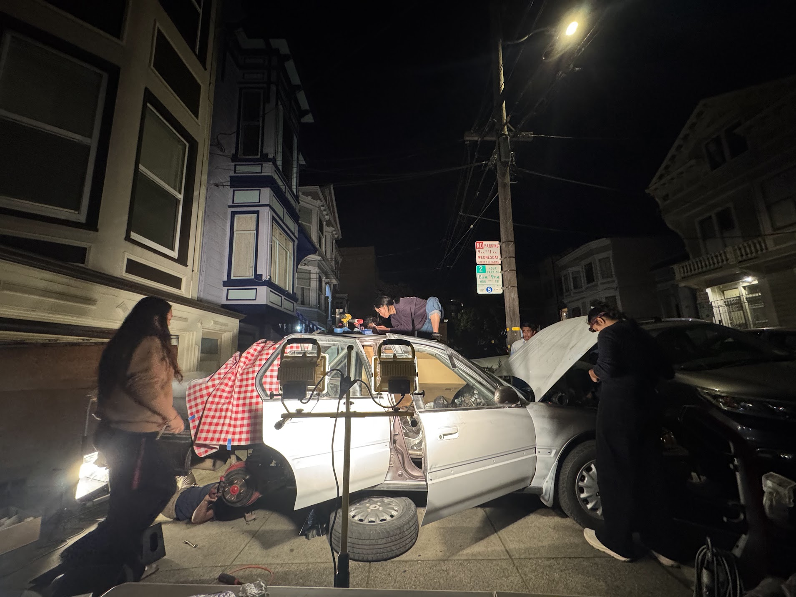
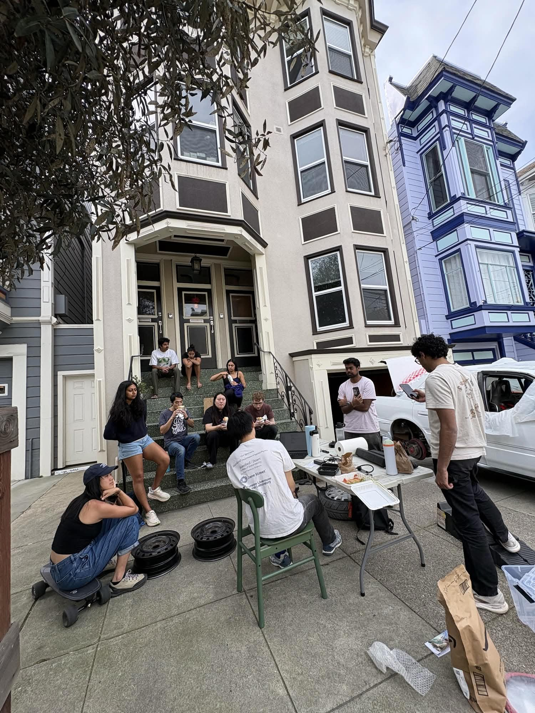
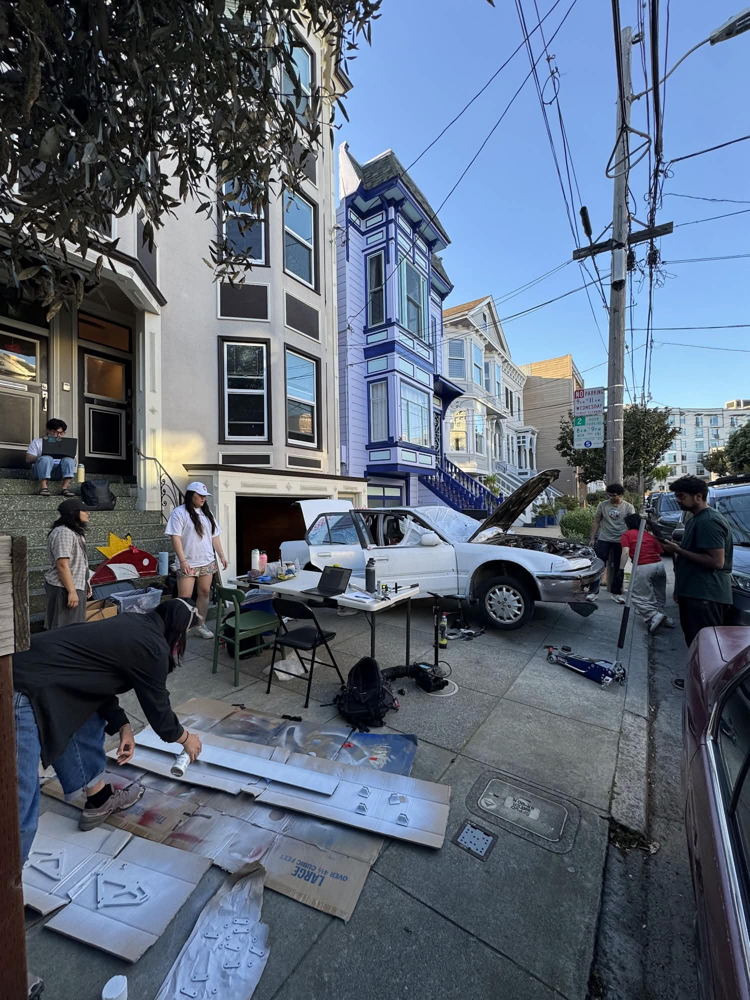
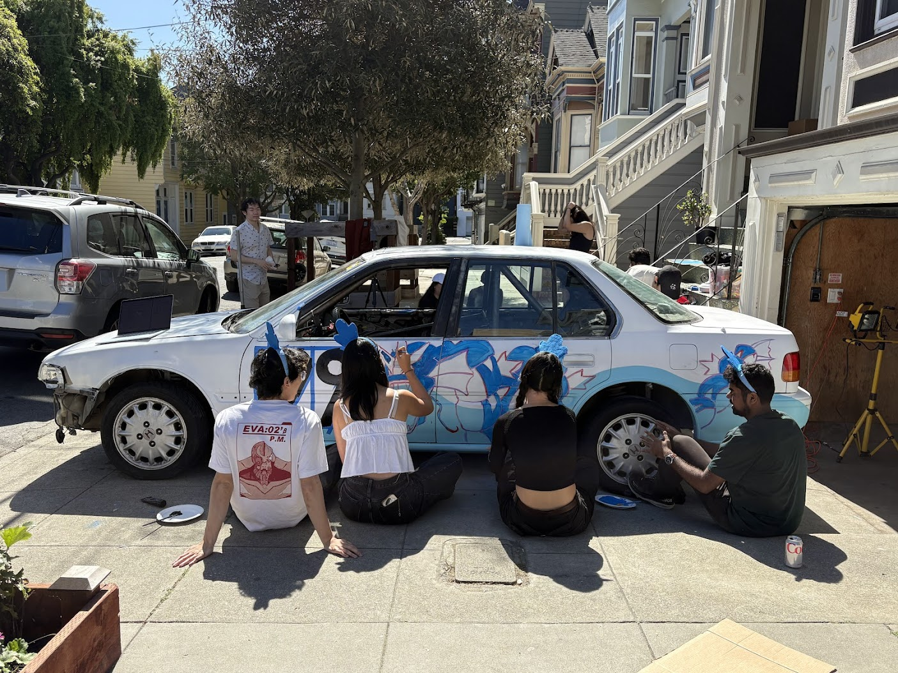
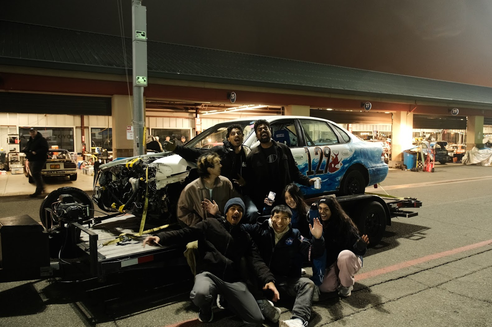
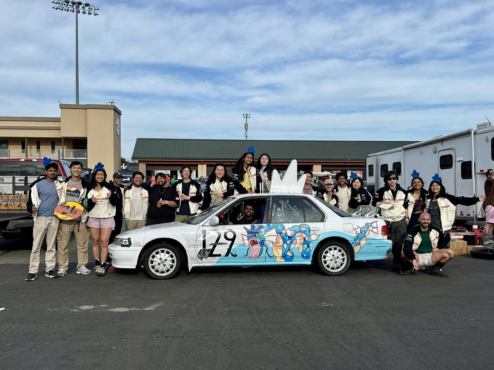

# Story

- **Season 1:** was all about getting our hands on _any_ car and getting it working, of course, we picked an `Automatic '97 Toyota Avalon`.
- **Season 2:** our first real race, and of course we decided the `25:01 Thunderhill` was the right place to get started.
- **Season 3:** we took the `'97 Avalon` to Sonoma and crashed hard into the wall, ending our race early. The car was finished, but not the team.
- **Season 4:** was our come back evolution, and we really gave it everything. An all new manual car, jackets, telemetry, and a giant weekend party.
- **Season 5:** To be announced :)

# The Cars

  

    
  

  

    
  

  
1997 Toyota Avalon - Magicarp

  
1992 Honda Accord - Gearados

# The Team

  

    
  

  

    
  

  
late night jobs with work lights

  
team meetings on the front porch w burritos

  

    
  

  

    
  

  
multiple jobs on the weekends

  
painting the car with friends

# Race Results

  

    
  

  

    
  

  
2025.06.01 - 25:01 Thunderhill - Judge's Choice

  
2026.12.12 - Arse-Freeze-Apalooza 2025 - DNF

  

2026.03.22 - Sears Pointless - Heroic Fix

# Sponsoring

## Mission

- Magicar Motors is a team of friends making the most of life.
    - We are looking for sponsors who also believe in applying friendship and engineering to do something awesome.

## Process

1. Reach out! And send us a bit about yourself or your company
2. We’ll chat about the vision we see for working with each other
    1. We’re particularly excited about long-term relationships for multiple races
3. Media production, content strategy, livery design, etc.
4. Smiles and good racing

## You might be a great sponsor if

- You’re looking to promote local involvement or youth inspiration
- You’re a brand looking to reach a younger audience
- You’re building a product relevant to any engineering/productivity discipline
- You’re an individual looking to add a sticker or shout something out on stream

## Involvement

- Brand placement on merch
- Brand placement on a vehicle
- Stream shoutouts
- Dedicated social media content
- Access to internal team progress updates
- Whatever exciting things lay at the intersection at your vision and ours!

## Contact Points

- Shihao Cao, https://x.com/shihao_cao
- Magicar Motors IG https://www.instagram.com/magicarmotors
  - Give us a follow! We'll be racing again later in 2026.