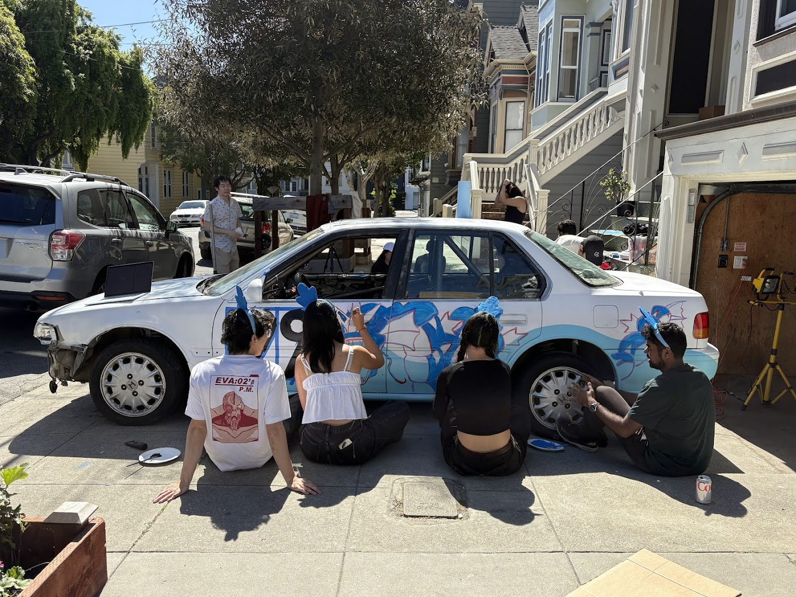
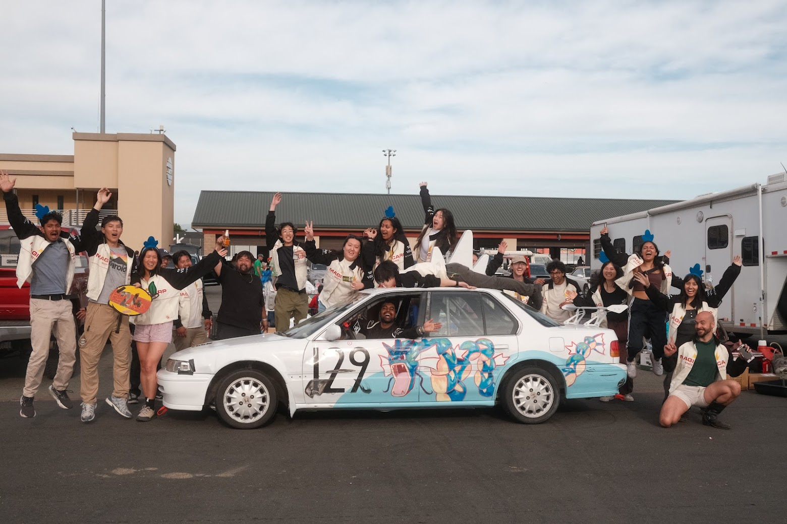
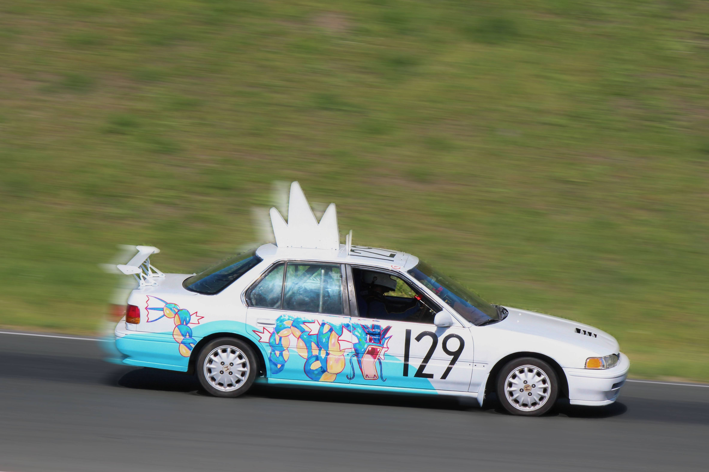

<nav class="landing-nav">
  <a href="/" class="landing-nav-logo">Magicar Motors</a>
  <input type="checkbox" id="landing-nav-toggle" class="landing-nav-toggle-checkbox">
  <label for="landing-nav-toggle" class="landing-nav-toggle-label" aria-label="Toggle menu">
    
    
    
  </label>
  <ul class="landing-nav-links">
    <li><a href="/about-the-team">About the Team</a></li>
    <li><a href="/meet-the-team">Meet the Team</a></li>
    <li><a href="/community">Community</a></li>
    <li><a href="/sponsorship">Sponsorship</a></li>
    <li><a href="/blogs">Blogs</a></li>
  </ul>
</nav>

  

    
  

  
We're a bunch of friends building race cars after work.

  

    
  

  
We're a big silly happy family.

  

    
  

  
The accord on track -- (replace with the collage?)

  

    
  

  
replace this photo with more family vibe photos

<h1 class="visually-hidden">Magicar Motors — Racing Team</h1>
