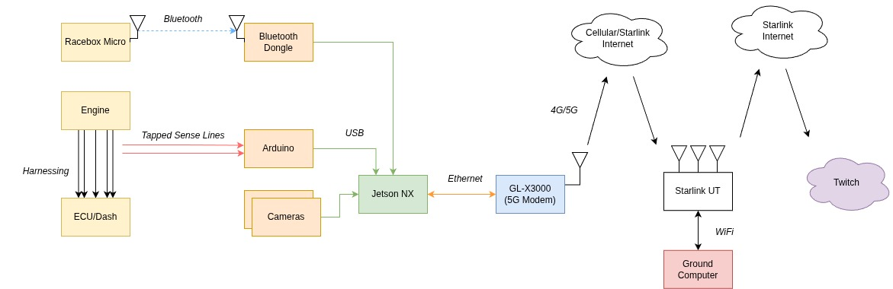

# Introduction

This is a two-part series talking about the telemetry system that Jacky and I built.

Objective:

- Build a live telemetry system so that home base and spectators can follow along with what the driver is seeing real time
- Build a review system so that drivers can review and improve their on track performance
- Build a system for to relay car state so that mechanics and technicans can track realtime

Requirements:

- Multiple camera feeds with reliable video transmission
- Driver inputs and engine state tapped from vehicle electrical harnesses
    - We are driving a car without OBD2, so we must tap many signals via analog sensing
- Built in 3 days

These objectives and requirements drove us build a custom solution. In the first part of this blog, we’ll talk about the hardware BOM and build out. In the second part we’ll talk about the software for live monitoring and in-post review.

# Questions?
If you are interested in installing this setup on your own race car, reach out to us on X at [@shihao_cao](https://x.com/shihao_cao). For a `$2000` donation to the team, we will hop on calls with you to help you get things setup until it works.

# Design

## Hardware BOM

<table style="min-width: 900px; border-collapse: collapse; width: 100%; font-size: 0.8em;">
  <thead>
    <tr>
      <th style="white-space: nowrap; padding: 6px 12px; text-align: left;">Component</th>
      <th style="white-space: nowrap; padding: 6px 12px; text-align: left;">Model</th>
      <th style="white-space: nowrap; padding: 6px 12px; text-align: left;">Specs</th>
      <th style="white-space: nowrap; padding: 6px 12px; text-align: left;">Power</th>
      <th style="white-space: nowrap; padding: 6px 12px; text-align: left;">Cost</th>
      <th style="white-space: nowrap; padding: 6px 12px; text-align: left;">Category</th>
      <th style="padding: 6px 12px; text-align: left; min-width: 200px;">Notes</th>
    </tr>
  </thead>
  <tbody>
    <tr>
      <td style="white-space: nowrap; padding: 6px 12px;">Forward Wide Camera</td>
      <td style="white-space: nowrap; padding: 6px 12px;"><a href="https://www.amazon.com/Logitech-C920x-Pro-HD-Webcam/dp/B085TFF7M1">Logitech C920x</a></td>
      <td style="white-space: nowrap; padding: 6px 12px;">1080p x 30fps</td>
      <td style="white-space: nowrap; padding: 6px 12px;">USB - 2.5W</td>
      <td style="white-space: nowrap; padding: 6px 12px;">$70</td>
      <td style="padding: 6px 12px;">Video</td>
      <td style="padding: 6px 12px;">Driver POV</td>
    </tr>
    <tr>
      <td style="white-space: nowrap; padding: 6px 12px;">Driver Camera</td>
      <td style="white-space: nowrap; padding: 6px 12px;"><a href="https://www.amazon.com/Logitech-C920x-Pro-HD-Webcam/dp/B085TFF7M1">Logitech C920x</a></td>
      <td style="white-space: nowrap; padding: 6px 12px;">1080p x 30fps</td>
      <td style="white-space: nowrap; padding: 6px 12px;">USB - 2.5W</td>
      <td style="white-space: nowrap; padding: 6px 12px;">$70</td>
      <td style="padding: 6px 12px;">Video</td>
      <td style="padding: 6px 12px;">Being able to see the shifting and pedal movements is cool</td>
    </tr>
    <tr>
      <td style="white-space: nowrap; padding: 6px 12px;">On Board Compute</td>
      <td style="white-space: nowrap; padding: 6px 12px;"><a href="https://www.amazon.com/seeed-studio-reComputer-J4012-Edge-Pre-Installed/dp/B0C88V4CB7/">Jetson Orin NX</a></td>
      <td style="white-space: nowrap; padding: 6px 12px;">16GB RAM, NVENC Accelerator</td>
      <td style="white-space: nowrap; padding: 6px 12px;">12V/5A → 60W Max</td>
      <td style="white-space: nowrap; padding: 6px 12px;">$1150</td>
      <td style="padding: 6px 12px;">Compute</td>
      <td style="padding: 6px 12px;">We don’t ever want video encoding to be the bottleneck, so we wanted a hardware encoding accelerator</td>
    </tr>
    <tr>
      <td style="white-space: nowrap; padding: 6px 12px;">5G Modem</td>
      <td style="white-space: nowrap; padding: 6px 12px;"><a href="https://www.amazon.com/GL-iNet-GL-X3000-Multi-WAN-Detachable-WireGuard/dp/B0C5RCQ8N5">GL-X3000</a></td>
      <td style="white-space: nowrap; padding: 6px 12px;">5G Compatible, physical SIM</td>
      <td style="white-space: nowrap; padding: 6px 12px;">12V/2.5A → 30W Max</td>
      <td style="white-space: nowrap; padding: 6px 12px;">$323</td>
      <td style="padding: 6px 12px;">Connectivity</td>
      <td style="padding: 6px 12px;">5G is likely overkill, but the bandwidth headroom is nice</td>
    </tr>
    <tr>
      <td style="white-space: nowrap; padding: 6px 12px;">SIM Card + Plan</td>
      <td style="white-space: nowrap; padding: 6px 12px;"><a href="https://www.visible.com/plans">Visible+</a></td>
      <td style="white-space: nowrap; padding: 6px 12px;">Unlimited data</td>
      <td style="white-space: nowrap; padding: 6px 12px;">—</td>
      <td style="white-space: nowrap; padding: 6px 12px;">$45/mo</td>
      <td style="padding: 6px 12px;">Connectivity</td>
      <td style="padding: 6px 12px;">Verizon generally works well at TH and Sonoma</td>
    </tr>
    <tr>
      <td style="white-space: nowrap; padding: 6px 12px;">GPS/Accel</td>
      <td style="white-space: nowrap; padding: 6px 12px;"><a href="https://www.amazon.com/RACEBOX-Micro-25Hz-GPS-Accelerometer/dp/B0DF5PX5X9/">Racebox Micro</a></td>
      <td style="white-space: nowrap; padding: 6px 12px;">25Hz, &lt;1m accuracy</td>
      <td style="white-space: nowrap; padding: 6px 12px;">12V, 0.2W Max</td>
      <td style="white-space: nowrap; padding: 6px 12px;">$125</td>
      <td style="padding: 6px 12px;">Telemetry</td>
      <td style="padding: 6px 12px;">Also works standalone with your phone</td>
    </tr>
    <tr>
      <td style="white-space: nowrap; padding: 6px 12px;">Bluetooth Dongle</td>
      <td style="white-space: nowrap; padding: 6px 12px;"><a href="https://www.amazon.com/dp/B0161B5ATM">UD100-G03</a></td>
      <td style="white-space: nowrap; padding: 6px 12px;">BLE</td>
      <td style="white-space: nowrap; padding: 6px 12px;">USB, 2.5W Max</td>
      <td style="white-space: nowrap; padding: 6px 12px;">$39</td>
      <td style="padding: 6px 12px;">Telemetry</td>
      <td style="padding: 6px 12px;">Jetson doesn’t have built-in BT; Racebox relays over BLE</td>
    </tr>
    <tr>
      <td style="white-space: nowrap; padding: 6px 12px;">Microcontroller</td>
      <td style="white-space: nowrap; padding: 6px 12px;"><a href="https://www.amazon.com/Arduino-ATmega2560-Compatible-Advanced-Projects/dp/B0046AMGW0/">Arduino Mega 2560</a></td>
      <td style="white-space: nowrap; padding: 6px 12px;">54 Digital IO, 16 Analog Inputs</td>
      <td style="white-space: nowrap; padding: 6px 12px;">USB, 1W Max</td>
      <td style="white-space: nowrap; padding: 6px 12px;">$49</td>
      <td style="padding: 6px 12px;">Telemetry</td>
      <td style="padding: 6px 12px;">Bit overkill — a smaller 5V Arduino would be plenty</td>
    </tr>
  </tbody>
</table>

### Totals
- Total cost: \~1850 for listed parts. **~$2000** when including random wires, resistors/diodes, butt joints, t splices, small wires, solder, perfboard, zipties, etc.
- Total power: `~100W` max theoretical, in practice steady state power draw was likely closer to `20/30W maximum`

## Telemetry Points

<table style="min-width: 700px; border-collapse: collapse; width: 100%; font-size: 0.8em;">
  <thead>
    <tr>
      <th style="white-space: nowrap; padding: 6px 12px; text-align: left;">Telemetry Point</th>
      <th style="white-space: nowrap; padding: 6px 12px; text-align: left;">Sense Strategy</th>
      <th style="white-space: nowrap; padding: 6px 12px; text-align: left;">Signal Type</th>
      <th style="white-space: nowrap; padding: 6px 12px; text-align: left;">Arduino Pin</th>
      <th style="padding: 6px 12px; text-align: left; min-width: 180px;">Sense Line</th>
    </tr>
  </thead>
  <tbody>
    <tr>
      <td style="white-space: nowrap; padding: 6px 12px;">Video 1</td>
      <td style="padding: 6px 12px;">Camera</td>
      <td style="padding: 6px 12px;">Digital</td>
      <td style="white-space: nowrap; padding: 6px 12px;">—</td>
      <td style="padding: 6px 12px;">—</td>
    </tr>
    <tr>
      <td style="white-space: nowrap; padding: 6px 12px;">Video 2</td>
      <td style="padding: 6px 12px;">Camera</td>
      <td style="padding: 6px 12px;">Digital</td>
      <td style="white-space: nowrap; padding: 6px 12px;">—</td>
      <td style="padding: 6px 12px;">—</td>
    </tr>
    <tr>
      <td style="white-space: nowrap; padding: 6px 12px;">Brake Indicator</td>
      <td style="padding: 6px 12px;">Binary yes/no voltage</td>
      <td style="padding: 6px 12px;">12V divided down, 4.3X</td>
      <td style="white-space: nowrap; padding: 6px 12px;">A5</td>
      <td style="padding: 6px 12px;">White/Green Brake Light Line</td>
    </tr>
    <tr>
      <td style="white-space: nowrap; padding: 6px 12px;">Battery Voltage</td>
      <td style="padding: 6px 12px;">Analog</td>
      <td style="padding: 6px 12px;">12V divided down, 4.3X</td>
      <td style="white-space: nowrap; padding: 6px 12px;">A6</td>
      <td style="padding: 6px 12px;">Tap off the PDB +12V bus</td>
    </tr>
    <tr>
      <td style="white-space: nowrap; padding: 6px 12px;">Throttle Position</td>
      <td style="padding: 6px 12px;">Calibrate 0–100</td>
      <td style="padding: 6px 12px;">5V analog</td>
      <td style="white-space: nowrap; padding: 6px 12px;">A9</td>
      <td style="padding: 6px 12px;">D11 ECU D connector</td>
    </tr>
    <tr>
      <td style="white-space: nowrap; padding: 6px 12px;">Engine Coolant Temp (T/W)</td>
      <td style="padding: 6px 12px;">Lookup table</td>
      <td style="padding: 6px 12px;">5V analog</td>
      <td style="white-space: nowrap; padding: 6px 12px;">A8</td>
      <td style="padding: 6px 12px;">D13 ECU D Connector</td>
    </tr>
    <tr>
      <td style="white-space: nowrap; padding: 6px 12px;">MAP</td>
      <td style="padding: 6px 12px;">Lookup table</td>
      <td style="padding: 6px 12px;">5V analog</td>
      <td style="white-space: nowrap; padding: 6px 12px;">A10</td>
      <td style="padding: 6px 12px;">D13 ECU D Connector</td>
    </tr>
    <tr>
      <td style="white-space: nowrap; padding: 6px 12px;">RPM (Tach)</td>
      <td style="padding: 6px 12px;">Derive instantaneous pulses/sec</td>
      <td style="padding: 6px 12px;">12V square wave → 5V</td>
      <td style="white-space: nowrap; padding: 6px 12px;">D19</td>
      <td style="padding: 6px 12px;">A7 BLU Dash Connector</td>
    </tr>
    <tr>
      <td style="white-space: nowrap; padding: 6px 12px;">VSS</td>
      <td style="padding: 6px 12px;">Derive instantaneous pulses/sec</td>
      <td style="padding: 6px 12px;">12V square wave → 5V</td>
      <td style="white-space: nowrap; padding: 6px 12px;">D18</td>
      <td style="padding: 6px 12px;">B10 ECU B Connector</td>
    </tr>
    <tr>
      <td style="white-space: nowrap; padding: 6px 12px;">GPS</td>
      <td style="padding: 6px 12px;">Racebox</td>
      <td style="padding: 6px 12px;">Digital</td>
      <td style="white-space: nowrap; padding: 6px 12px;">—</td>
      <td style="padding: 6px 12px;">—</td>
    </tr>
    <tr>
      <td style="white-space: nowrap; padding: 6px 12px;">Accel</td>
      <td style="padding: 6px 12px;">Racebox</td>
      <td style="padding: 6px 12px;">Digital</td>
      <td style="white-space: nowrap; padding: 6px 12px;">—</td>
      <td style="padding: 6px 12px;">—</td>
    </tr>
    <tr>
      <td style="white-space: nowrap; padding: 6px 12px;">Gyro</td>
      <td style="padding: 6px 12px;">Racebox</td>
      <td style="padding: 6px 12px;">Digital</td>
      <td style="white-space: nowrap; padding: 6px 12px;">—</td>
      <td style="padding: 6px 12px;">—</td>
    </tr>
  </tbody>
</table>

## Telemetry System Design

  

Telemetry Block Diagram

### Design Considerations
We had considered a Starlink Mini as vehicle data offload but decided against this because I was unsure if we would be in a garage. The line-of-sight requirements are tough.

We has also considered running the stream on the vehicle, but this would have been very rough as the stream would have died if the telemetry computer restarted. So keeping that separate was a great choice.

## Power

  

Onboard Power Diagram

### Power Considerations

I had considered adding another secondary battery onboard, but descoped it at the time to make deadlines.

At the race, we noticed two significant downsides:
- You can deplete the vehicle battery while running telemetry which means we had to repeatedly hook up a battery charger while running telem only
- Cranking the starter brings the `+12V rail below +10V` which browns out the computers. This meant stalling the car and restarting the car would necessitate a power cycle, very annoying.

For the next iteration we plan to add a small auxiliary battery with:
- a relay that switches off if the kill switch is switched to cut power to telemetry
- diodes that prevent auxiliary battery from flowing to the `main electrical bus`

## Driver Communication

We ran driver communication completely parallel to telemtry. We would communicate with drivers via `discord` audio call. This meant that if the `telemetry` stack restarted, our `audio` communications persisted. This was very useful during `hotpits` when we shut off telemetry, or if we ever had to crank the starter on track.