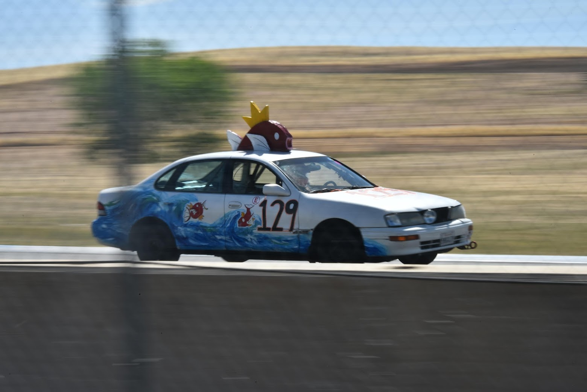
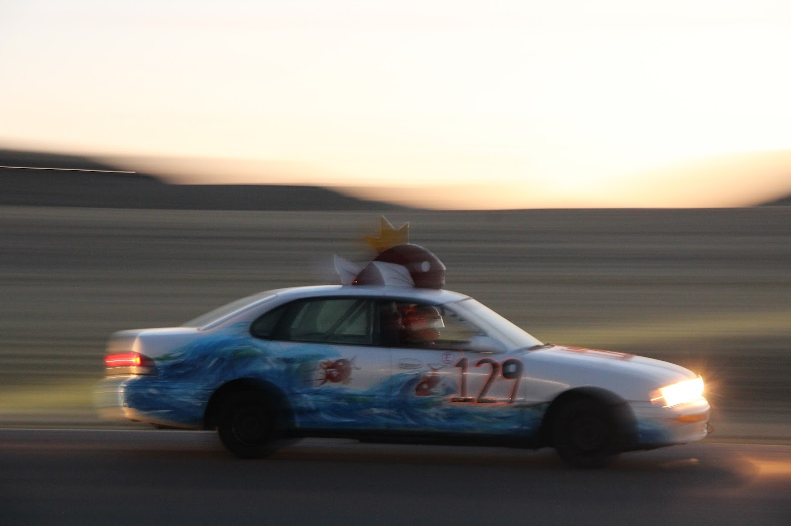
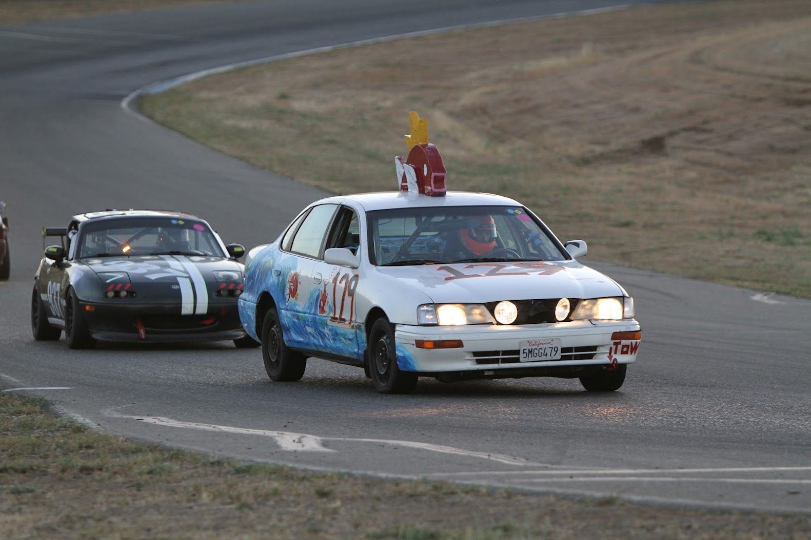
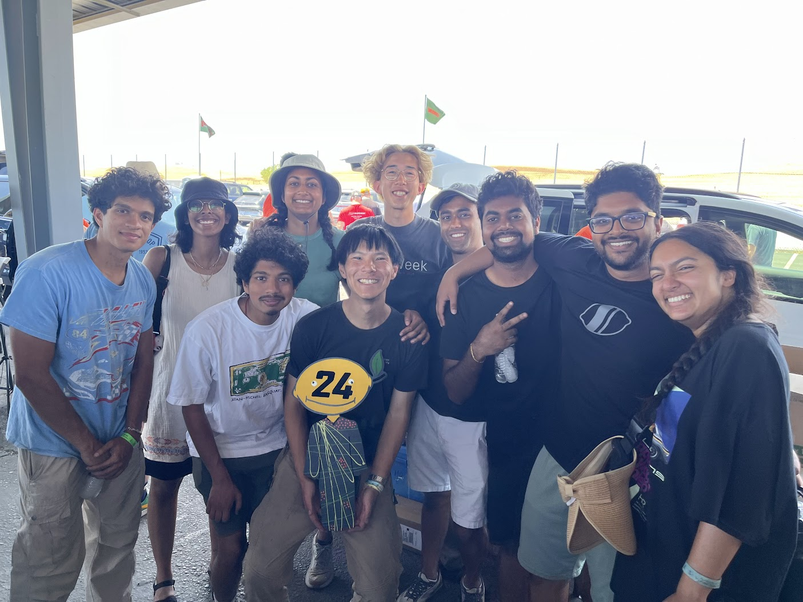
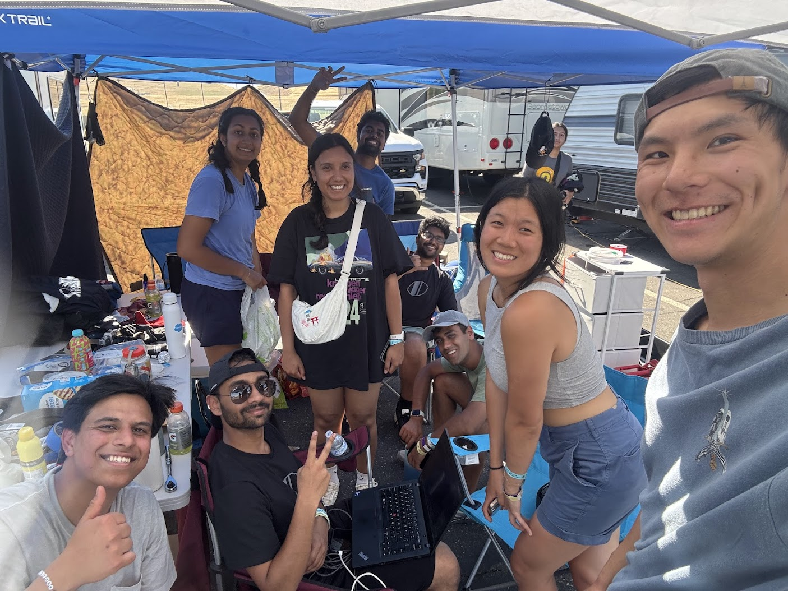

  

    
  

The car cookin it down the back straight

  

    
  

  

    
  

  
flying around the track

  
leading the pack!

  

    
  

  

    
  

  
after we won judges choice

  
pit crew homies

